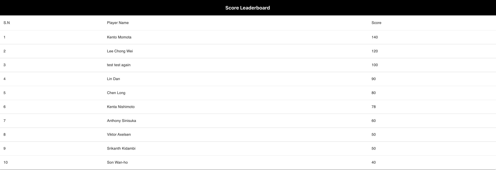

# Game App

A simple React application that displays a list of top players with highest scores


# Getting Started

## Prerequisites

- Docker
- react-native-cli
- Node.js
- npm (or yarn)

## Server Setup:

```shell
git clone https://github.com/lftrobusgauli/gin-gql-api.git
run docker-compose build && docker-compose up
```

## Build and run Docker image

1. Build docker image

```shell
docker build -t game_app .
```

2. Run the container

```shell
docker run -it --name game-app -p 3000:3000 game_app
```

3. Once docker container is up, it can be accessed in url https://localhost:3000

## Client Setup:

These instruction will get you a copy of the project up and running on your local machine for development and testing purpose.

- git clone https://github.com/lftrobusgauli/react-leaderboard-app
- `npm install or yarn install`
- `npm start`
- `npm run test`

## Built With

- [React](https://reactjs.org/) - The JavaScript library used for building user interfaces
- [Apollo-client](https://www.apollographql.com/docs/react/) - A library for javascript that enables you to manage both local and remote data with GraphQl.
- [Material-UI](https://material-ui.com/) - A UI library for React based on Material Design

### `npm test`

Launches the test runner in the interactive watch mode.\
See the section about [running tests](https://facebook.github.io/create-react-app/docs/running-tests) for more information.
